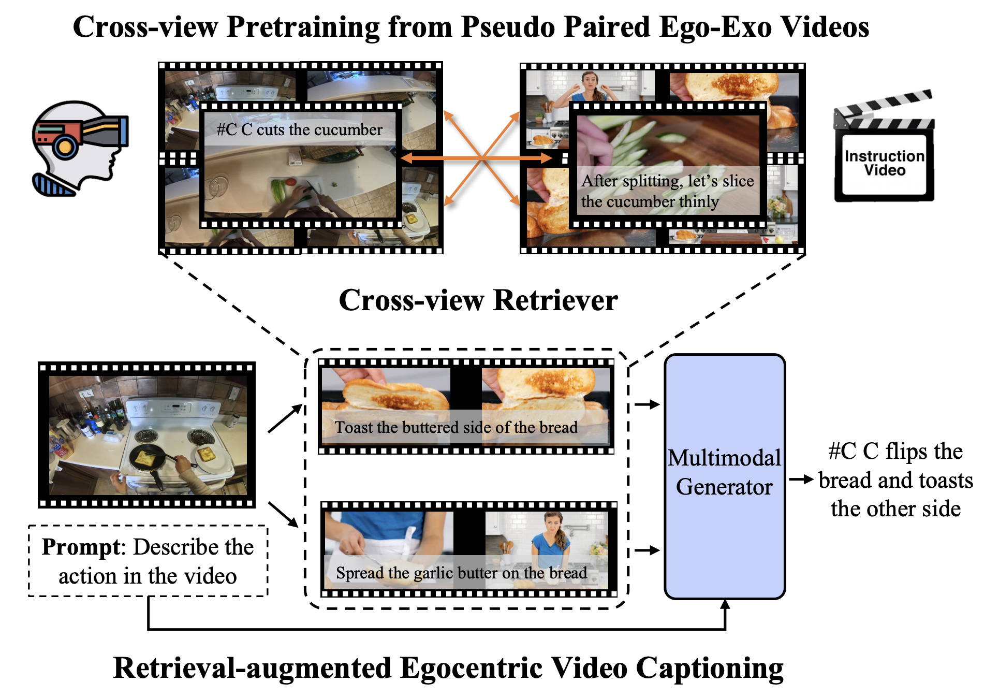

# Egoinstructor
Official Pytorch implementation for Egoinstructor at CVPR 2024

> **Retrieval-Augmented Egocentric Video Captioning**<br>
> [Jilan Xu](https://jazzcharles.github.io/), [Yifei Huang](https://hyf015.github.io/), [Junlin Hou](https://houjunlin.github.io/), [Guo Chen](https://scholar.google.com/citations?user=lRj3moAAAAAJ), [Yuejie Zhang](https://cs.fudan.edu.cn/3e/d0/c25921a278224/page.htm), [Rui Feng](https://faculty.fudan.edu.cn/fengrui/zh_CN/index.htm), [Weidi Xie](https://weidixie.github.io/)<br>
> IEEE/CVF Conference on Computer Vision and Pattern Recognition (**CVPR**), 2024<br>


[](https://arxiv.org/abs/2401.00789)
[](https://jazzcharles.github.io/Egoinstructor/)


Given an egocentric video, Egoinstructor automatically retrieves semantically relevant instructional videos (e.g. from HowTo100M) via a pretrained cross-view retrieval model and leverages the visual/textual information to generate the caption of the egocentric video.


<div align="center">

</div>


## Roadmap

- [x] Retrieval code and data released
- [x] Captioning code and data released 
- [ ] Online Demo
- [ ] Pre-trained checkpoints

## Prepare environment
Please refer to [env.md](./env.md)

## Cross-view Retrieval Module
To train a ego-exo crossview retrieval module, please refer to [retrieval](./retrieval/).

## Retrieval-augmented Captioning
To train a retrieval-augmented egocentric video captioning model, please refer to [captioning](./captioning/).

## Citation
If this work is helpful for your research, please consider citing us.
```
@article{xu2024retrieval,
  title={Retrieval-augmented egocentric video captioning},
  author={Xu, Jilan and Huang, Yifei and Hou, Junlin and Chen, Guo and Zhang, Yuejie and Feng, Rui and Xie, Weidi},
  journal={arXiv preprint arXiv:2401.00789},
  year={2024}
}
```

## License

This project is released under the [MIT License](./LICENSE)

## Acknowledgements
This project is built upon [LaViLA](https://github.com/facebookresearch/LaViLa/) and [Otter](https://github.com/Luodian/Otter). Thanks to the contributors of the great codebase.