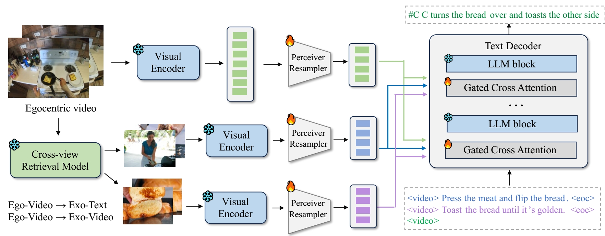

# Egoinstructor captioning module
Official Pytorch implementation for the retrieval-augmented captioning module in Egoinstructor at CVPR 2024

> **Retrieval-Augmented Egocentric Video Captioning**<br>
> [Jilan Xu](https://jazzcharles.github.io/), [Yifei Huang](https://hyf015.github.io/), [Junlin Hou](https://houjunlin.github.io/), [Guo Chen](https://scholar.google.com/citations?user=lRj3moAAAAAJ), [Yuejie Zhang](https://cs.fudan.edu.cn/3e/d0/c25921a278224/page.htm), [Rui Feng](https://faculty.fudan.edu.cn/fengrui/zh_CN/index.htm), [Weidi Xie](https://weidixie.github.io/)<br>
> IEEE/CVF Conference on Computer Vision and Pattern Recognition (**CVPR**), 2024<br>


[](https://arxiv.org/abs/2401.00789)
[](https://jazzcharles.github.io/Egoinstructor/)


The retrieval-augmented captioning module is a video-conditioned LLM. It takes retrieved exocentric videos from HowTo100M as references, and generates captions of egocentric videos.

<div align="center">

</div>

## Inference 
First download the checkpoint from huggingface

| Model | Link | Size |
|-------------------------|--------|--------|
| Egoinstructor_captioner_4shot | 🤗 [HF link](https://huggingface.co/Jazzcharles/EgoInstructor-ModelZoo/blob/main/egoinstructor_captioner_4shot.pt) | 4.19G
| Egoinstructor_captioner_2shot | 🤗 [HF link](https://huggingface.co/Jazzcharles/EgoInstructor-ModelZoo/blob/main/egoinstructor_captioner_2shot.pt) | 4.19G

Then, prepare your in-context and test samples (videos and narrations), and save the video path and narrations into a json file, please refer to the format in [./assets/testdata.json](./assets/testdata.json), and run:

```
python test_video.py \
    --testdata ./assets/testdata.json \
    --pretrained_name_or_path="luodian/OTTER-MPT1B-RPJama-Init" \
    --pretrained_checkpoint=egoinstructor_captioner_4shot.pt \
    --max_shot=4 \
```

## Preparing Training and Evaluation Data
Please refer to [docs/data.md](docs/data.md).

## Training and Evaluation 
First, modify the path to your data, metadata in [./scripts/train_slurm.sh](./scripts/train_slurm.sh).
```
DATAPATH_EGO=/path/to/your/egovideos/
DATAPATH_EXO=/path/to/your/exovideos/
METAPATH=/path/to/your/metadata.json
TRAIN_CONFIG_PATH=/path/to/your/train_config.json
```
Then run training with the script
```
./scripts/train_slurm.sh
```
or run the following command to train a 4-shot captioning model on 8 GPUs with total batch size 32.
```
accelerate launch --config_file=./configs/accelerate_config_ddp_8gpu.yaml \
    main.py \
    --pretrained_model_name_or_path="luodian/OTTER-MPT1B-RPJama-Init" \
    --datapath_ego=/path/to/your/egovideos/ \
    --datapath_exo=/path/to/your/exovideos/ \
    --metapath=/path/to/your/metadata.json \
    --train_config_path=/path/to/your/train_config.json \
    --batch_size=4 \
    --num_epochs=5 \
    --report_to_wandb \
    --wandb_entity=test \
    --run_name=OTTER-MPT1B-RPJama-testrun \
    --wandb_project=OTTER-MPT1B \
    --workers=16 \
    --lr_scheduler=cosine \
    --learning_rate=1e-5 \
    --warmup_steps_ratio=0.01 \
    --offline \
    --xview \
    --max_shot=4 \
    --save_ckpt_each_epoch \
```

To evaluate the model's retrieval-augmented captioning performance, modify the data path, metadata path, and pretrained checkpoint in [./scripts/test_slurm.sh](./scripts/test_slurm.sh)
```
TRAINED_CKPT: /path/to/the/trained/checkpoint.pt
```
and run
```
./scripts/test_slurm.sh
```
