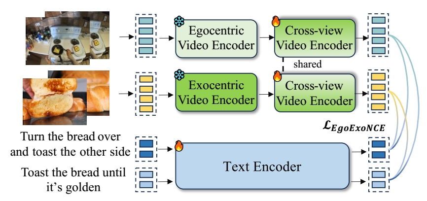

# Egoinstructor retrieval module
Official Pytorch implementation for the crossview retrieval module in Egoinstructor at CVPR 2024

> **Retrieval-Augmented Egocentric Video Captioning**<br>
> [Jilan Xu](https://jazzcharles.github.io/), [Yifei Huang](https://hyf015.github.io/), [Junlin Hou](https://houjunlin.github.io/), [Guo Chen](https://scholar.google.com/citations?user=lRj3moAAAAAJ), [Yuejie Zhang](https://cs.fudan.edu.cn/3e/d0/c25921a278224/page.htm), [Rui Feng](https://faculty.fudan.edu.cn/fengrui/zh_CN/index.htm), [Weidi Xie](https://weidixie.github.io/)<br>
> IEEE/CVF Conference on Computer Vision and Pattern Recognition (**CVPR**), 2024<br>

[](https://arxiv.org/abs/2401.00789)
[](https://jazzcharles.github.io/Egoinstructor/)

The retrieval module is trained on pseudo paired egocentric videos (Ego4d) and exocentric videos (HowTo100M) using a EgoExoNCE loss. 

<div align="center">

</div>


## Preparing Pretrain Data
Please refer to [docs/data.md](docs/data.md). If you would like to extract the video features on your own, please refer to [feature_extraction/feature_extraction.md]

## Training and Evaluation 
Training with slurm script
```
./scripts/train_slurm.sh
```
or run
```
python main_pretrain_contrastive.py --config ./configs/egohowto.yml
```

To evaluate the model's retrieval performance, modify the resume checkpoint path in ./configs/test.yml
```
resume: /path/to/the/trained/checkpoint.pt
```
and run
```
python main_pretrain_contrastive.py --config ./configs/test.yml
```

### Pretrained Model 

| Model | Link | Size |
|-------------------------|--------|--------|
| Crossview Retrieval Module | 🤗 [HF link](https://huggingface.co/Jazzcharles/EgoInstructor-ModelZoo/blob/main/retrieval_checkpoint_best.pt) | 1.83G
